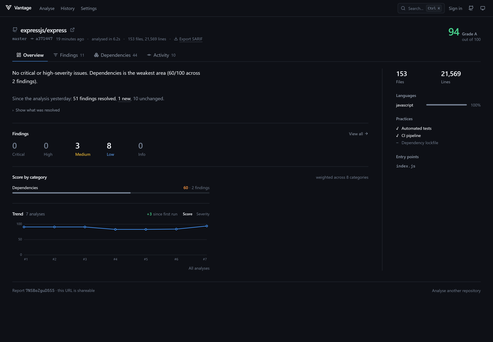
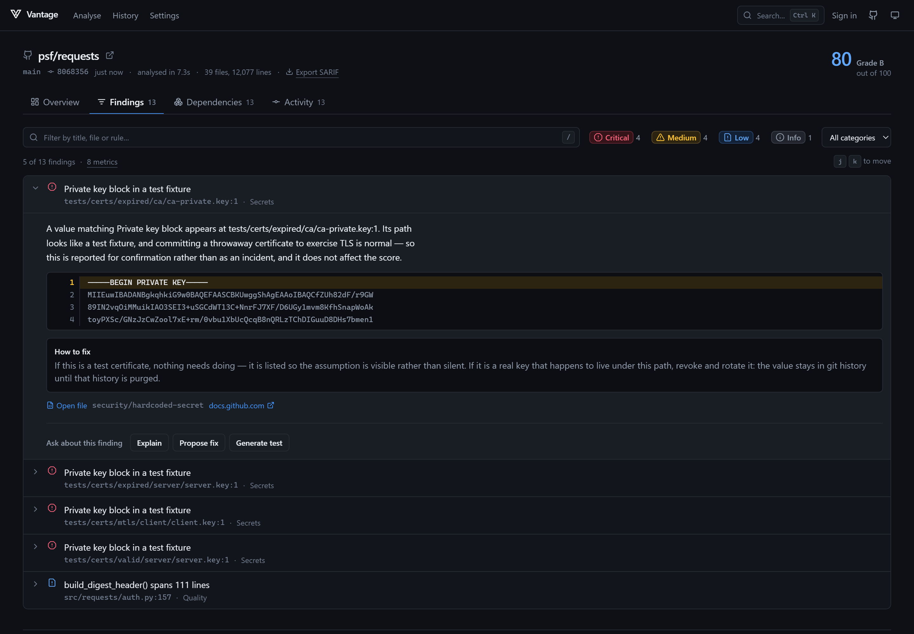
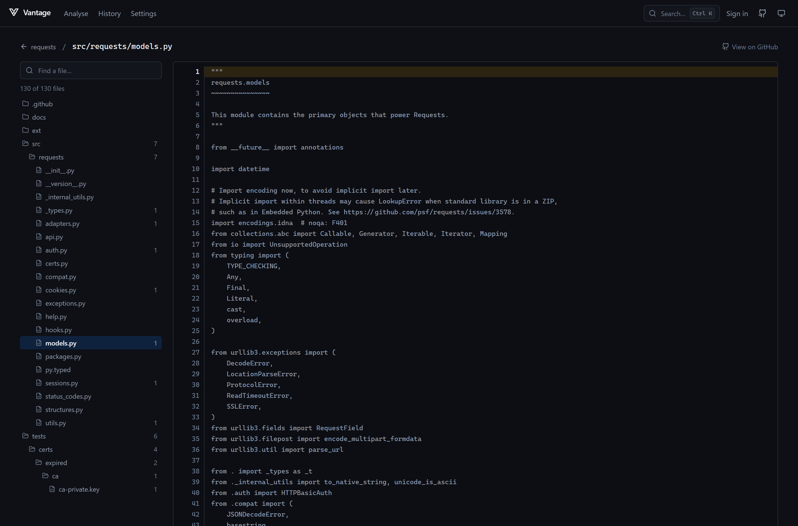
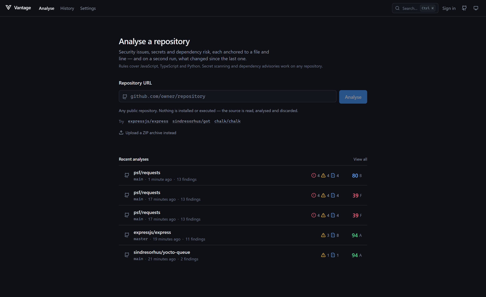
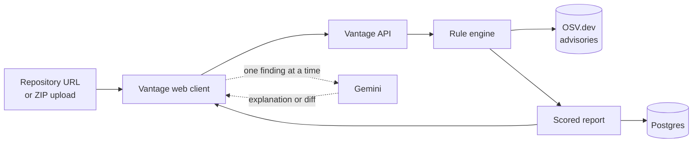
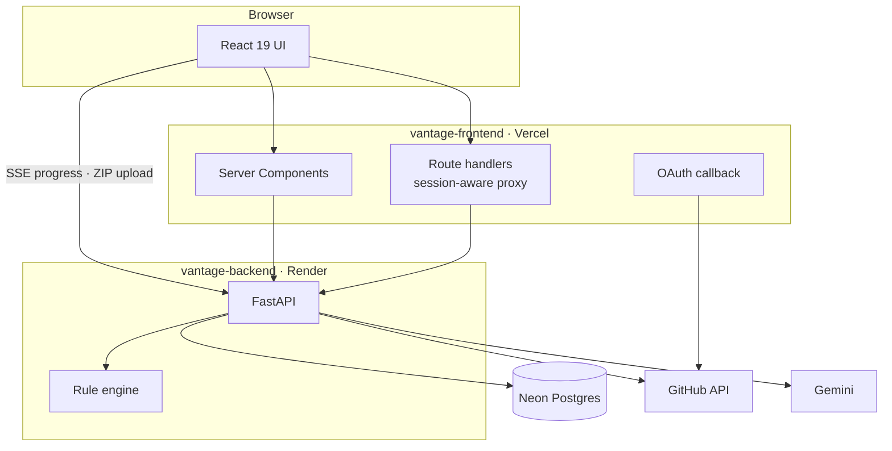

<div align="center">

<picture>
  <source media="(prefers-color-scheme: dark)" srcset="public/mark-light.png">
  
</picture>

<h1>Vantage</h1>

**Security issues, secrets and dependency risk — anchored to a file and line,
and on a second run, what changed since the last one.**

[](https://github.com/Asmodeus14/Vantage/actions/workflows/ci.yml)
[](LICENSE)

**[Try it](https://vantage67.vercel.app)** ·
[API repository](https://github.com/Asmodeus14/vantage-backend) ·
[Architecture](docs/ARCHITECTURE.md) ·
[Roadmap](docs/ROADMAP.md)

</div>

---

Most static analysers hand you a list of problems, then hand you the same list
next week — because they have no memory. A finding that moved down three lines
reads as a new finding; one you already decided to live with comes back every
run. People stop reading the list, which is the moment the tool stops working.

Vantage gives findings an identity that survives an edit. Analyse a repository
twice and the second report says what actually changed: what you fixed, what
appeared, what you had already accepted. Every finding links to its line in a
real file view, and with an API key configured you can ask a model to explain it
or propose a patch — scoped to that one finding, returned as a diff you review.

Findings can leave, too: export a report as **SARIF 2.1.0** for GitHub code
scanning or any SARIF viewer, or post one consolidated comment on a pull
request saying what that branch changed.

> **Scope, stated plainly.** The rule engine understands JavaScript, TypeScript
> and Python. Secret scanning and dependency advisories work on any repository;
> anything else gets structural metrics and little more. A scanner that
> overstates its reach is one you stop trusting after the first quiet run.

> **This repository is the web client.** The rule engine, the API and the
> database live in
> [`vantage-backend`](https://github.com/Asmodeus14/vantage-backend). You need
> both to run Vantage — see [Getting started](#getting-started).

## Screenshots

Captured from the live instance, unedited.

**The report.** [`expressjs/express`](https://github.com/expressjs/express) on
`master`, compared against an earlier run of the `4.19.0` tag. Score, the
weakest category, the trend across all seven analyses, and — the point of the
product — the line that no first-time scan can produce:
*51 findings resolved, 1 new, 10 unchanged*.



**Findings.** [`psf/requests`](https://github.com/psf/requests). Ordered by what
to fix first rather than by severity alone, the offending line in context, how
to fix it, and the three AI actions — each scoped to this one finding.

Worth reading closely: `5 of 13 findings · 8 metrics`. Measurements like "this
file is long" are real but not work, so they sit behind a count rather than
burying the rest. And the private keys are recognised as TLS test fixtures —
reported for confirmation, not as an incident, and kept out of the score.



**The file viewer.** The whole file, the tree beside it, and findings marked in
the gutter. Folders show how many findings they contain.



**Starting an analysis.** A repository URL, a ZIP, or — signed in — a picker of
your own repositories.



## Features

### Finding what is wrong

- **Injection and friends** — SQL injection, command injection, `eval`, path
  traversal, SSRF, weak hashing, predictable randomness, permissive CORS and
  unverified JWTs, for JavaScript/TypeScript and Python. A dangerous sink alone
  is reported as evidence; a dangerous sink a *request-derived value reaches* is
  reported as a vulnerability, and the two are graded differently.
- **Known vulnerabilities** from OSV.dev with real CVE/GHSA identifiers, for npm
  and PyPI, direct and transitive.
- **Committed credentials** — provider-shaped tokens and entropy-checked
  assignments, with the value redacted everywhere it appears.
- **Correctness bugs** in React and Python, and structural measurements (long
  files, deep nesting) taken with comments and string literals stripped out.
- **Confidence on every finding.** A heuristic match says so instead of
  presenting a guess as a certainty — and only proven findings can cap the
  grade.

### Knowing what to fix first

- **Findings are prioritised, not just sorted.** Severity × confidence × how
  actionable the category is, computed once on the server. A leaked credential
  outranks a high-severity guess, and no volume of measurements can bury a
  security finding.
- **Measurements are separated from defects.** "This file is 1,050 lines long"
  has no fix, only a judgement, so metrics sit behind a visible count and are
  weighted zero in the score. A large project is not gradeable down for being
  large.
- **Every finding says what, why, where and how**, with somewhere to read more.
  That is enforced across the whole rule set by a test, not by convention.

### Knowing whether it improved

- **Re-run and compare.** The second report on a repository reports what was
  resolved and what is new, using a fingerprint that survives a dependency
  version bump, a changed line count, or code inserted above.
- **Accept what you are living with.** Mark a finding *Not an issue* with a
  reason and it stops appearing on future runs of that repository — reversibly,
  and never silently: the count stays on screen with a toggle to reveal it.
- **Trend and churn.** Score over time, and which files both change often and
  carry findings.

### Working with the result

- **Open the file.** Every located finding links to its line in a full file
  view, with a tree beside it and findings marked in the gutter.
- **Ask a model about one finding.** Explain, propose a fix, or generate a test.
  Fixes come back as diffs you review; Vantage never writes to your working
  tree.
- **Take the findings elsewhere.** Export **SARIF 2.1.0** — validated against
  the OASIS schema, carrying Vantage's own cross-run fingerprints so an
  importer inherits stable identity instead of re-deriving a worse one from
  line numbers.
- **Comment on a pull request.** One consolidated comment saying what *that
  branch* changed, edited in place on every push rather than added to.
- **Shareable reports.** A report has its own URL and survives a refresh.
- **Keyboard-first.** Command palette, filter focus, and next/previous finding.

### Running it

- **Works with no configuration.** No API key and no database required; each
  absence is reported rather than hidden.
- **Sign in with GitHub, optionally.** Reports become yours, analyses spend your
  own GitHub rate limit rather than a shared one, and private repositories
  become analysable if you separately grant it.

## How it works



Analysis is a job, not a request: the client starts it and then watches genuine
per-stage progress over Server-Sent Events while the API fetches, extracts,
indexes and runs each rule.

## Architecture

Two deployable units in two repositories, released independently.



**Most traffic is proxied** through this server's route handlers, which keeps
the API origin private and lets each call carry the session. Two paths
deliberately go direct to the API: the **SSE progress stream**, because
serverless platforms buffer streaming responses, and the **ZIP upload**, because
they cap request bodies at a few megabytes.

**The OAuth exchange happens here, not on the API.** That keeps the client
secret off the API entirely, and makes the session cookie first-party — a cookie
set by the API would be third-party in production and blocked outright by Safari
and by Firefox in strict mode. The API never sets a cookie; this server reads
its own and forwards the session as a bearer token.

**The AI call is scoped to a single finding.** The client sends a report id, a
finding id, and one value from a closed set. There is no free-text parameter, so
the endpoint cannot be repurposed as a general model proxy, and analysed source
reaches the model fenced and marked untrusted.

Fuller reasoning: [`docs/ARCHITECTURE.md`](docs/ARCHITECTURE.md) for the browser
side, [backend architecture](https://github.com/Asmodeus14/vantage-backend/blob/master/docs/ARCHITECTURE.md)
for the rule engine, finding identity and persistence.

## Tech stack

| Layer | Technology | Purpose |
|---|---|---|
| Framework | Next.js 15 (App Router), React 19 | Server Components for the report pages; route handlers as a session-aware proxy |
| Language | TypeScript 5.7 | `strict` plus `noUncheckedIndexedAccess`; `lib/types.ts` mirrors the API's schemas |
| Styling | Tailwind CSS v4 | Semantic tokens in `app/globals.css`, exposed via `@theme inline` |
| Components | Radix UI, `cmdk`, `lucide-react` | Accessible primitives, command palette, icons |
| Theming | `next-themes` | Light and dark, following the system by default |
| Markdown | `react-markdown`, `remark-gfm`, `rehype-sanitize` | Renders model output; raw HTML is never parsed |
| Highlighting | Shiki | Lazy-loaded, dual-theme code blocks |
| Charts | — | Hand-rolled SVG in `lib/scale.ts` and `components/charts/` |
| Testing | Vitest, Testing Library | 144 tests, run in CI on every push |
| API | FastAPI · Python 3.12 · SQLAlchemy 2 | Separate repository |

## Getting started

**Requires** Node 20+ and Python 3.12+.

The two halves are separate repositories, so clone both:

```bash
git clone https://github.com/Asmodeus14/vantage-backend
git clone https://github.com/Asmodeus14/Vantage
```

**1 — API**, in one terminal:

```bash
cd vantage-backend
python -m venv menv && menv/Scripts/activate   # Linux/macOS: source menv/bin/activate
pip install -r requirements.txt
cp .env.example .env
python -m uvicorn app.main:app --reload --port 5000
```

**2 — Web client**, in another:

```bash
cd vantage-frontend
npm install
cp .env.example .env.local
npm run dev
```

Open <http://localhost:3000>. The API's interactive docs are at
<http://127.0.0.1:5000/docs>.

### It runs with nothing configured

Neither an AI key nor a database is required, and every absence is reported
rather than hidden:

| Missing | What happens |
|---|---|
| `GEMINI_API_KEY` | Analysis is unaffected. The AI actions render **disabled with the reason shown** — no canned response is ever substituted for a model. |
| `DATABASE_URL` | Reports are held in memory and cleared on restart. `/api/health` and the UI say so. |
| Sign-in variables | Public repositories still analyse. The sign-in control renders disabled, naming the variables that are missing. |

## Environment variables

Copy `.env.example` to `.env.local`. This repository reads six variables; the
API has its own set, documented in
[its README](https://github.com/Asmodeus14/vantage-backend#configuration).

**Required**

| Variable | Purpose |
|---|---|
| `BACKEND_URL` | Where the API is, for Server Components and route handlers. Server-side only — never sent to the browser, so the API origin can stay private. Defaults to `http://127.0.0.1:5000`. |
| `NEXT_PUBLIC_BACKEND_URL` | The same API, but reachable from the browser. Needed for the two paths that cannot be proxied: the SSE progress stream and the ZIP upload. Defaults to `http://127.0.0.1:5000`. |

**Optional — sign-in.** All four are required together; with any missing,
sign-in reports itself unconfigured and everything else still works.

| Variable | Purpose |
|---|---|
| `GITHUB_CLIENT_ID` | From your GitHub OAuth App. The API needs the same value. |
| `GITHUB_CLIENT_SECRET` | Used only in this server's OAuth callback. The API deliberately never reads it. |
| `INTERNAL_API_SECRET` | Authenticates this server to the API when exchanging a GitHub token for a session. Not a user credential. **Must match the API exactly.** |
| `SESSION_SECRET` | Signs the OAuth `state` parameter. Stateless, so sign-in works across multiple server instances. |

Create the OAuth App at <https://github.com/settings/developers> with the
callback URL `<your-origin>/api/auth/github/callback`. `.env.example` carries
the commands for generating the two shared secrets.

Never commit `.env.local`. It is gitignored; keep it that way.

## Project structure

```
app/
├── page.tsx                  Analyse — repository URL, ZIP upload, repo picker
├── analysing/[jobId]/        Live SSE progress
├── r/[id]/                   Report — Overview · Findings · Dependencies · Activity
│   └── f/[...path]/          File viewer with finding gutter
├── history/                  Past analyses, grouped by repository
├── settings/                 Account, appearance, server capabilities, shortcuts
└── api/                      Route handlers — proxy to the API, plus OAuth
components/
├── report/                   Report surfaces, the file viewer, AI actions
├── charts/                   Hand-rolled SVG chart primitives
├── markdown/                 Model-output renderer and code blocks
└── ui/                       Primitives on Radix, restyled to our tokens
lib/
├── types.ts                  Mirrors the API's schemas — the contract
├── api.ts                    Typed client with uniform structured errors
├── session.ts                Signed OAuth state and session cookie (server-only)
├── scale.ts                  Chart maths — scales, ticks, path builders
└── use-analysis-stream.ts    SSE state machine
docs/                         Architecture, roadmap, brand, product audit
tests/                        Vitest + Testing Library
```

## Development

| Command | What it does |
|---|---|
| `npm run dev` | Development server on port 3000 |
| `npm run build` | Production build |
| `npm start` | Serve the production build |
| `npm run lint` | ESLint |
| `npm run typecheck` | `tsc --noEmit` |
| `npm run test` | Vitest, once |
| `npm run test:watch` | Vitest in watch mode |

All four checks run in CI on every push and pull request. Run them before
opening one — `build` in particular, because several App Router mistakes surface
nowhere else.

`app/dev/markdown` renders every markdown fixture for visual inspection of the
model-output renderer.

### Keyboard

| Shortcut | Action |
|---|---|
| `⌘/Ctrl K` | Command palette |
| `/` | Focus the findings filter |
| `j` / `k` | Next / previous finding |

## Deployment

| Unit | Platform | Notes |
|---|---|---|
| Web client | Vercel | Set the six variables above. Leave the Output Directory unset — Next.js emits `.next`. |
| API | Render | `render.yaml` is committed in that repository; its start command runs migrations before the server. |
| Database | Neon Postgres | Optional. Without it, reports live in memory. |

Omitting the sign-in variables is supported — but omitting them *by accident* is
the likely mistake, so check `/api/health` after deploying. Free tiers sleep when
idle; the UI reports a waking backend rather than appearing hung.

## Roadmap

Shipped:

- [x] Rule engine over npm and PyPI dependencies, secrets, React and Python
      correctness, and structure
- [x] Finding identity that survives an edit, and report-to-report diffing
- [x] Accepting findings, per repository, reversibly
- [x] File viewer with a finding gutter
- [x] AI actions scoped to one finding, with whole-file context
- [x] GitHub sign-in, report ownership, repository picker
- [x] CI on both repositories
- [x] Security rules for injection, traversal, SSRF, weak crypto and JWTs,
      graded by whether a request-derived value actually reaches the sink
- [x] Prioritisation, and measurements separated from defects
- [x] SARIF 2.1.0 export, validated against the OASIS schema
- [x] One consolidated pull request comment, edited in place on re-runs

Planned:

- [ ] Reachability for transitive advisories — "your lockfile mentions a
      vulnerable package" versus "your code can reach it"
- [ ] A GitHub App, so pull request results become a *check run* that can block
      a merge rather than a comment. Needs job state to survive a restart of a
      host that sleeps — the comment above is the useful half that does not
- [ ] More Python lockfile formats (`Pipfile.lock`, `uv.lock`) so range-declared
      projects get scanned, not just listed
- [ ] Streaming AI responses
- [ ] Verify sign-in in Safari and Firefox strict mode

Known limitations are tracked honestly in [`docs/ROADMAP.md`](docs/ROADMAP.md).

## Contributing

1. Fork and branch from `master`.
2. Make the change, with tests — and for a bug, a test that fails first.
3. Run `npm run lint`, `npm run typecheck`, `npm run test` and `npm run build`.
4. Update the documentation in the same pull request.
5. Open a pull request describing what changed and **why**.

[`CONTRIBUTING.md`](CONTRIBUTING.md) covers the conventions and, more usefully,
the things that are deliberate rather than accidental — so they are not
"simplified" away.

## Security

Never commit API keys or secrets; everything sensitive is an environment
variable, and `.env.local` is gitignored.

To report a vulnerability, use GitHub's private reporting rather than a public
issue. [`SECURITY.md`](SECURITY.md) has the details, along with what is already
defended: model output is never parsed as markup, the session cookie is
first-party and `HttpOnly`, and the OAuth `state` is signed so sign-in cannot
become an open redirect.

## FAQ

**What is Vantage?**
A static analyser for repositories that remembers. It reports vulnerabilities,
committed secrets, correctness bugs and structural problems anchored to a file
and line — and, on a second run, what changed since the first.

**Which model does it use?**
Google Gemini, called by the API rather than the browser. The model is
configurable; the default is `gemini-3.6-flash`.

**Do I need an API key?**
No. Analysis is entirely rule-based and works without one. A key only enables
the three AI actions, which render disabled with the reason when it is absent.

**Does it need a database?**
No. Without `DATABASE_URL` reports are held in memory and cleared on restart,
and the UI says so.

**Is it self-hostable?**
Yes — both halves. Neither requires an account with anything except GitHub, and
only for optional sign-in.

**Does it change my code?**
No. Proposed fixes are diffs you review. Vantage never writes to a working tree,
which is also the backstop that stops a prompt injection becoming code
execution.

**Why two repositories?**
They deploy independently to different platforms and have separate release
cadences. `lib/types.ts` mirrors the API's schemas to keep the contract explicit.

## Licence

[MIT](LICENSE).
